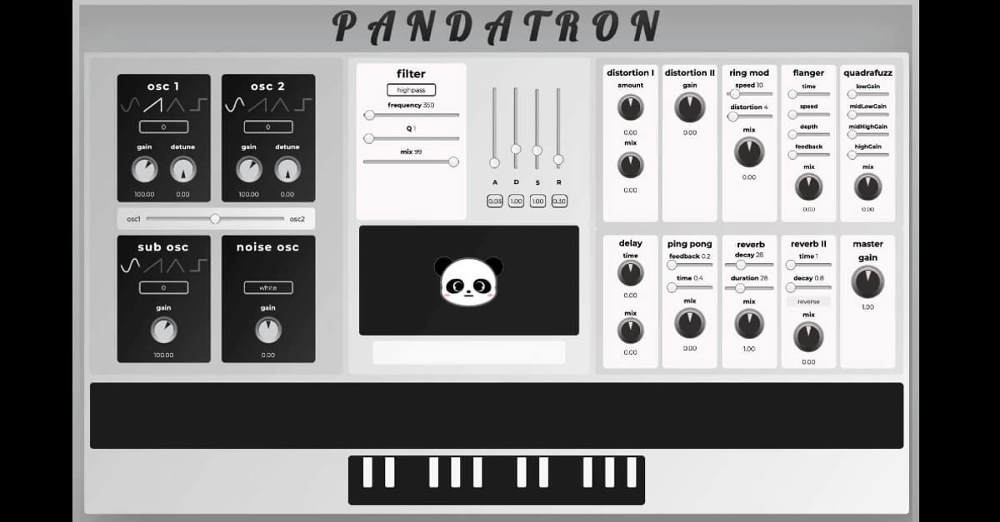

<h1>PANDATRON</h1>

<h5>A synthesizer for the browser <a href="https://thomasfoydel.github.io/pandatron/">live demo here</a></h5>

Pandatron is a synthesizer built with the Web Audio API. The interface is built with React. Some of the effects are from a library names Pizzicato. React-Spring is used for some animation. Global state is stored using React Context. Originally the knobs were from a package called react-rotary-knob, but it is not compatible with react version 18, so a new knob component had to be built based on that package when this project was upgraded.

As soon as I heard about the webaudio API in a dev conference talk on youtube I knew I was going to have a hard time sleeping until I had finished building a synthesizer with it.

I got to apply a lot of prior knowledge from producing electronic music, so this project was a lot of fun. It was easy to get sounds going but it was challenging to think up a structure that would allow me to apply an envelope to the sound and to play multiple notes at the same time, because I was initially thinking of creating one to three oscillators per note, having them constantly running, and turning their gains on and off depending on which keys the user is currently pressing down on. I changed to an approach in which each note played is an instance of a class, a class which comes with functions that start and stop an oscillator, with timing based on envelope variable inputs. From looking at other web synths I also came across an amazing package called qwerty-hancock which solved the need for a keyboard.

I really wanted the panda's face to change expression based on the chord being played. Most search results gave me python algorithms that were way more intense than what I needed. I found a website called ChordFinder by Matt Rice, which had a working algorithm. And in JavaScript! Beautiful JavaScript! Adapting Matt's code to my project was basically just taking out the jquery dom manipulation and instead just returning a chord name, instead of setting the innerHTML of an element with it.

I made the distortion I effect using an algorithm from here http://stackoverflow.com/questions/22312841/waveshaper-node-in-webaudio-how-to-emulate-distortion

And I made the various kinds of noise using this method https://noisehack.com/generate-noise-web-audio-api/

I also used Pizzicato.js effects because it has a flanger (everyone loves flanger). Pizzicato was also used for the ping pong delay, reverb II, distortion II, quadrafuzz, ring modulator, and the low pass filter connected to the mousefield's y axis.

I used the wonderful react-spring animation library to make the color changes of the mousefield/lfo control component nice and smooth.

Heroku free tier ended at the end of 2022, so in 2023 I decided to move this project to GitHub Pages since it doesn't require a backend. I also updated and refactored a lot of it. Cleaning up old code and be oddly satisfying and a good reminder of the progress made since the initial writing.
